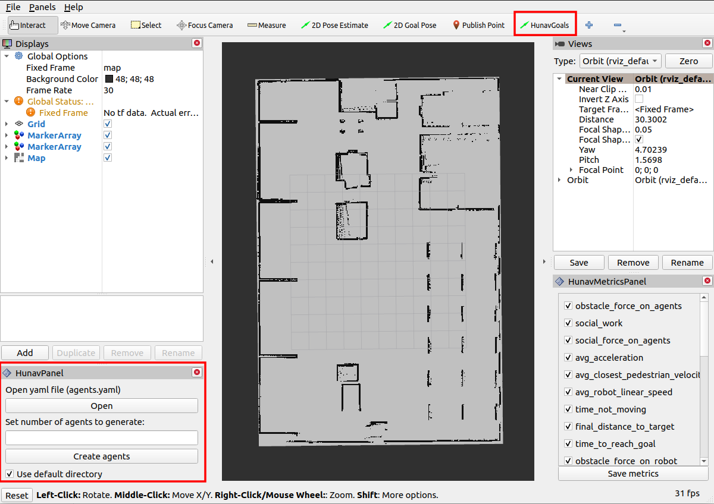
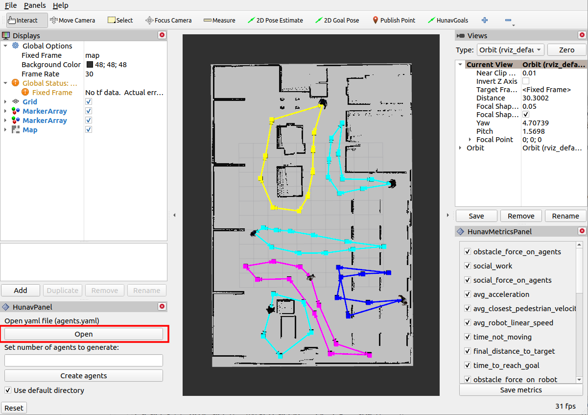
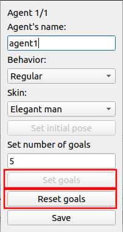
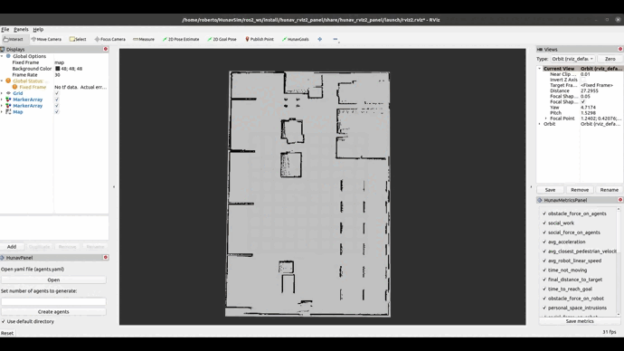
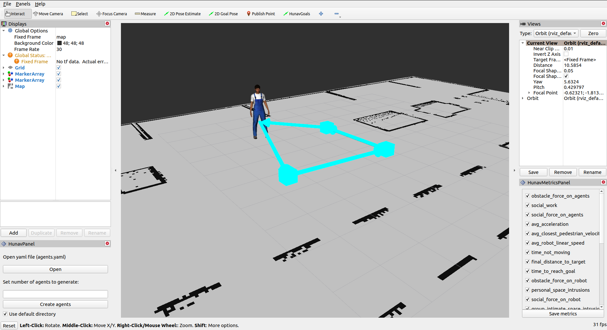

# HuNav RViz2 Panel

A ROS2 C++ package that contains two RViz2 panels to help in the configuration of the HuNavSim.

This package provides two RViz2 panels: 
* *HuNavPanel* - which allows to create and configure the hunav agents and save them in a Yaml configuration file. 
* *HunNavMetricsPanel* - which allows the selection of the metrics to be computed for a simulation.


**Tested in ROS2 Foxy**

# Dependencies

* ros-foxy-nav2-map-server
* ros-foxy-nav2-lifecycle-manager

# HuNavPanel for agents configuration

This panel helps to configure the HuNav agents visually. The configuration is then stored in the configuration file *agents.yaml* (placed in the install directory of the ROS workspace).
This file will be used by the Human Navigation behavior Simulator (HuNavSim) in order to spawn humans with different characteristics.

A previous 2D map of the navigation scenario is required. We will use nav2-map-server to load the map and visualize it in RViz (see the launch file **hunav_rviz2_launch.py**).

Beside of creating human agents, it also gives the possibility to open a Yaml file that has been generated previously.

## Steps to use HuNavPanel

A launch file for testing is provided to launch the panel:
```sh
ros2 launch hunav_rviz2_panel hunav_rviz2_launch.py
```

Some example maps related to the café simulated scenario are provided in the maps directory.

After launching the system we will see:


<!--  -->

The HuNavPanel provide two options:

* To open the base configuration file, agents.yaml
* To create and configure the hunav agents from scratch.

The first option allows to open a Yaml file that has already been generated. It is stored in the install directory of the ROS2 workspace:
```sh
/install/hunav_agent_manager/share/hunav_agent_manager/config/agents.yaml
```
Example:

<!--  -->

As result, we will visualize on the map, the initial position and goals for each agent indicated in the yaml file (as can be seen in the image above). In next iterations, we will allow the user to modify the agents features and to store the new changes.  

The second option allows to generate a new set of hunav agents. Each agent must have a name, behavior, skin, initial pose and goals as can be seen in the following images:

 
<!--   -->

Hunav agents' initial pose and goals are stored by using the HuNav RViz tool. To do so, click the "Set initial pose" button, and then, from the tool panel, select HunavGoals.

Once HunavGoals is active, move your mouse to the desired position on the map, and click on it. This will publish a MarkerArray (Agent) on ```/hunav_agent``` topic, and the agent marker will show on the map.

Follow the same procedure for the agents' goals. These goals are published as a MarkerArray (Squares) on ```/hunav_goals``` topic.

Example:


<!--  -->

Result:

<!--  -->

# HuNavMetricsPanel for metrics configuration

This panel shows the list of available metrics to be computed for a simulation.

Each metric is shown as a checkbox that can be selected or unselected by the user. It loads the current list of the file *metrics.yaml*, which is placed in the install directory of the ROS workspace. 


When the user has made her selection, the *save metrics* button must be pressed in order to store the changes in the file. 